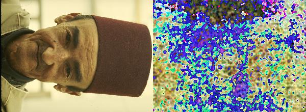
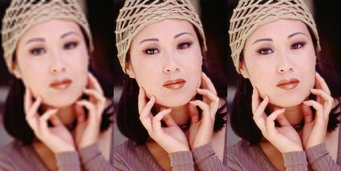

# ProjectLab1_SR

Notebooks and results of Pre-Upsampling model and ESRGAN pre-trained model

## Image SR

Image super-resolution is the process of obtaining the high-resolution image from corre-sponding low-resolution image
## Env preparation and Colab mounting

```bash
!git clone https://github.com/kkahloots/Generative_Models # this is for loading git with correct brach
from google.colab import drive
drive.mount('/content/drive')
!mkdir /content/drive/My\ Drive/Results
MAIN_SAVE_DIR = '/content/drive/My Drive/Results'
IMG_DIR = '/content/Generative_Models/data/.CBSD68' 
```


## Dataset Preparing and Convertion

```python
!git clone https://github.com/azeghost/LMDB_Datasets # github with dataset
!pip install colorlog
from colorlog import ColoredFormatter
images_dir = 'data/.CBSD68' #Folder to images ( without name of the folder which we moved images before)
validation_percentage = 30
valid_format = 'png'
transformer = SRLmdbTransformer(image_dir = images_dir, trans_func=shrink_fn,
                              validation_pct = validation_percentage, valid_image_formats = valid_format)
transformer.transform_store(labels_fn=get_label_by_filename,image_dir=images_dir, lmdb_dir = lmdb_dir
           ,category='training',target_size=(481, 321),color_mode='rgb')
transformer.transform_store(labels_fn=get_label_by_filename,image_dir=images_dir, lmdb_dir = lmdb_dir
           ,category='validation',target_size=(481, 321),color_mode='rgb')
```

## Visual Results (Pre-Upsampling) 



## Visual Results (ESRGAN) 




